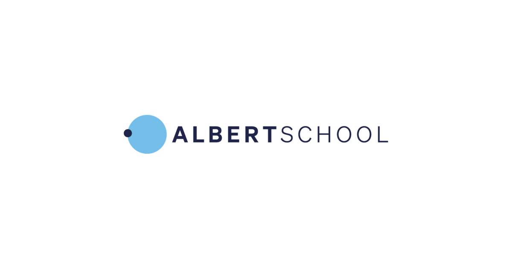

The material I use in teaching, sorted by school. LaTeX sources live in a private
repository; the PDFs actually handed out to students are published to
[github.com/cetiennec/cours-pdf](https://github.com/cetiennec/cours-pdf) and served
straight from GitHub.



<a class="school-card" href="centralesupelec/">
  

  
CentraleSupélec

  
Reinforcement Learning

</a>

<a class="school-card" href="ece/">
  

  
ECE Paris

  
Sampled Control Systems

</a>

<a class="school-card" href="albertschool/">
  

  
AlbertSchool

  
Mathematics Foundations

</a>

## [CentraleSupélec — Reinforcement Learning](centralesupelec/)

A rework of the PARL course: four lectures and written exercises, from MDPs to
model-free control.

## [ECE Paris — Sampled Control Systems](ece/)

Digital control taught to the full year group (500 students), April to June 2026:
$z$-transform, discretisation, sampled PID, filtering and Kalman estimation. Six lecture
decks, the final exam and the midterm quiz.

## [AlbertSchool — Mathematics Foundations](albertschool/)

The linear algebra and calculus behind machine learning: vectors and cosine similarity,
matrices and the forward pass, derivatives and the chain rule, gradient descent. Four
sessions, taught in English.
