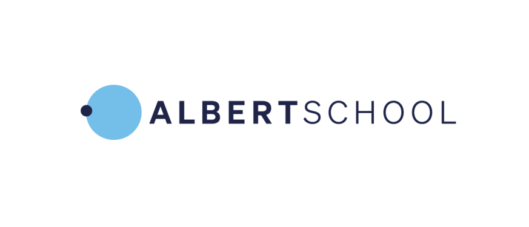

I have been teaching for 10 years in many formats: private tutoring, oral exams (colles), teaching assistant sessions, lectures in front of 150 students, student projects I supervise and, now, training for companies. All the content I designed is here.

The material is [freely available](https://github.com/cetiennec/cours-pdf) on this GitHub.



## Courses I designed

Courses where I wrote the material and/or designed the format.

<a class="school-card" href="centralesupelec/">
  

  
CentraleSupélec

  
Reinforcement Learning, Robotics elective, robotics projects

</a>

<a class="school-card" href="ece/">
  

  
ECE Paris

  
Sampled Control Systems, autonomous car project

</a>

<a class="school-card" href="albertschool/">
  

  
AlbertSchool

  
Mathematics Foundations

</a>

## Corporate training

Training I design and deliver for engineering teams in companies.

<a class="school-card" href="companies/">
  
🏢

  
Companies

  
Deep RL, PID and MPC

</a>

## Other teaching

Teaching assistant positions.

<a class="school-card" href="epfl/">
  

  
EPFL

  
Teaching assistant: MPC, legged robots, AI

</a>

