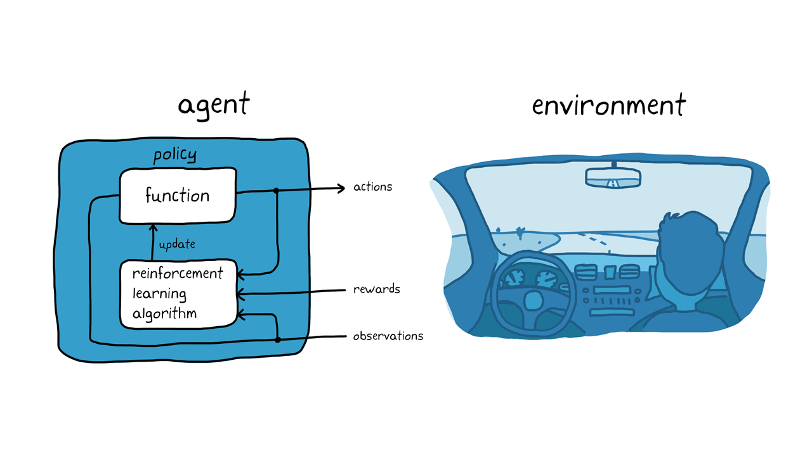

*The agent-environment loop in reinforcement learning*

A five-day training in **deep reinforcement learning** that alternates theory and practice
with **Stable-Baselines3** and **OpenAI Gym**: lectures in the morning, hands-on work in
the afternoon, and a final project on an environment taken from your own field.

The program below is a template; it can be adapted to your needs and the time available.

## Day 1: Reinforcement learning basics

**Morning**

- What RL is, and how it differs from supervised and unsupervised learning
- The building blocks: agent, environment, states, actions, rewards
- Real applications: games, robotics, finance
- The vocabulary: policy, state value, action value, reward, return; Markov decision
  processes (MDPs)

**Afternoon**

- Tabular methods: Monte Carlo, temporal difference (TD), SARSA, Q-learning
- Their strengths, limits and use cases
- *Hands-on:* implement a simple Q-learning agent on FrozenLake (OpenAI Gym)

## Day 2: OpenAI Gym environments

**Morning**

- The role of the environment in training an agent
- Standard environments: CartPole, MountainCar…
- Working with an environment: `env.reset()`, `env.step()`, `env.render()`
- Action and observation spaces

**Afternoon**

- Building your own environment with the Gym API
- *Hands-on:* a simple game with a custom reward logic

## Day 3: Stable-Baselines3

**Morning**

- Why SB3: reliable implementations of DQN, PPO, A2C…
- Installation and setup
- Plugging a Gym environment into SB3, a first PPO run on CartPole

**Afternoon**

- *Hands-on:* tune a PPO agent on CartPole
- Callbacks to steer training: early stopping, metric logging

## Day 4: Advanced algorithms

**Morning: Deep Q-Network (DQN)**

- From tabular methods to neural networks
- Replay buffer, target network
- *Hands-on:* DQN with SB3 on LunarLander

**Afternoon: Actor-Critic (A2C, PPO)**

- The actor-critic principle
- What PPO brings over DQN: sample efficiency, stability
- *Hands-on:* PPO on a continuous environment, BipedalWalker

## Day 5: Deployment and a project from your field

**Morning**

- Saving and reloading a trained agent
- Evaluating it on episodes it never saw in training
- Integrating it into a real application: robots, simulations, games

**Afternoon: final project**

- A complete project on an environment taken from your field: modelling, choice of
  algorithm, training, tuning and evaluation
- Wrap-up: the difficulties met and where to go next
