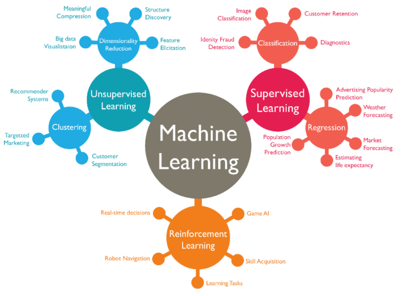

*AI taxonomy, source Google*

I was a teaching assistant for this course at EPFL.

## About the course

The theoretical concepts behind machine learning, and a set of tools to apply it to
problems from mechanical engineering.

## Topics

**Tools**

- Supervised learning: regression and classification
- Unsupervised learning: singular value decomposition, K-means
- Deep learning: a short introduction to neural networks
- Reinforcement learning: a short introduction to policy-gradient methods

**Theory**

- Optimisation: the role of convexity, gradient descent, least squares
- Statistics: the Bayesian approach, the bias-variance trade-off

[Course description in the EPFL coursebook](https://edu.epfl.ch/coursebook/en/foundations-of-artificial-intelligence-ME-390)
