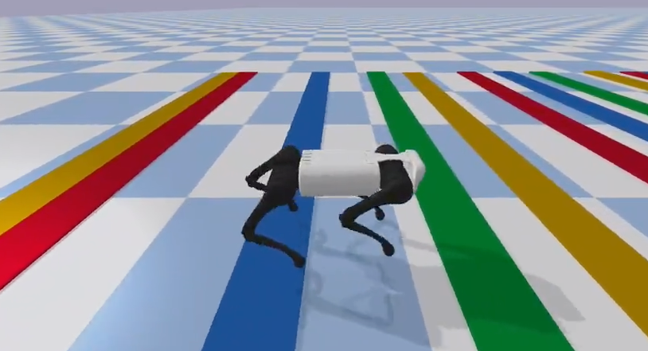

*Legged robots*

I was a teaching assistant for this Master course at EPFL.

## About the course

The design, control and applications of legged robots: a review of two-, four- and
multi-legged robots and of the control methods for legged locomotion. Students also learn
to analyse key papers in the field critically, and to design their own models and
locomotion controllers in simulation.

## Topics

- History of legged robotics: two-, four- and multi-legged robots
- Mechanical structures: passive and dynamic walkers
- Background concepts: static versus dynamic stability, stability criteria (zero-moment
  point, capturability…), energy consumption and cost of transport, state estimation
- Simple models of locomotion: rimless wheel, inverted pendulums (LIP, SLIP), template
  versus anchor models
- Control approaches: trajectory-based methods, virtual leg and virtual model control,
  hybrid zero dynamics, optimal control, planning, reinforcement learning and bio-inspired
  approaches
- Reading and presenting key papers of the field
- Numerical exercises: students build their own controllers for simulated legged robots,
  with weekly sessions with the assistants and the professor

[Course description in the EPFL coursebook](https://edu.epfl.ch/coursebook/en/legged-robots-MICRO-507)
