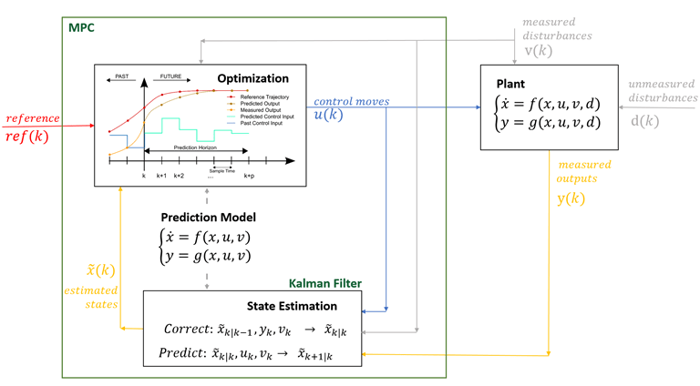

*MPC principle*

I was a teaching assistant for this Master course at EPFL.

## About the course

An introduction to the theory and practice of Model Predictive Control (MPC). MPC lets you
specify time-domain objectives flexibly, optimise the performance of complex multivariable
systems, and enforce constraints on the system's behaviour explicitly.

## Topics

- Convex optimisation and the optimal control theory MPC builds on
- Receding-horizon control of constrained linear systems
- Practical issues: tracking and offset-free control of constrained systems
- Theoretical properties: constraint satisfaction, invariant sets, stability of MPC
- An introduction to advanced topics in predictive control
- A simulation-based project giving hands-on experience with MPC

[Course description in the EPFL coursebook](https://edu.epfl.ch/coursebook/en/model-predictive-control-ME-425)
· Figure: [MathWorks](https://fr.mathworks.com/help/mpc/gs/what-is-mpc.html)
