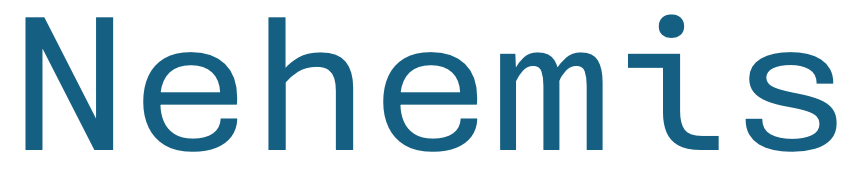
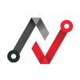
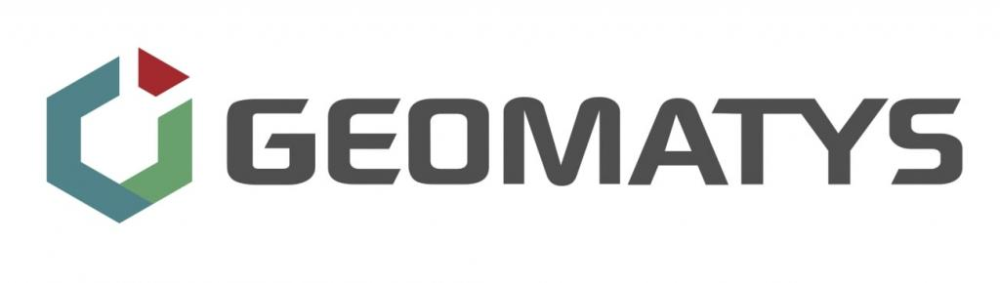
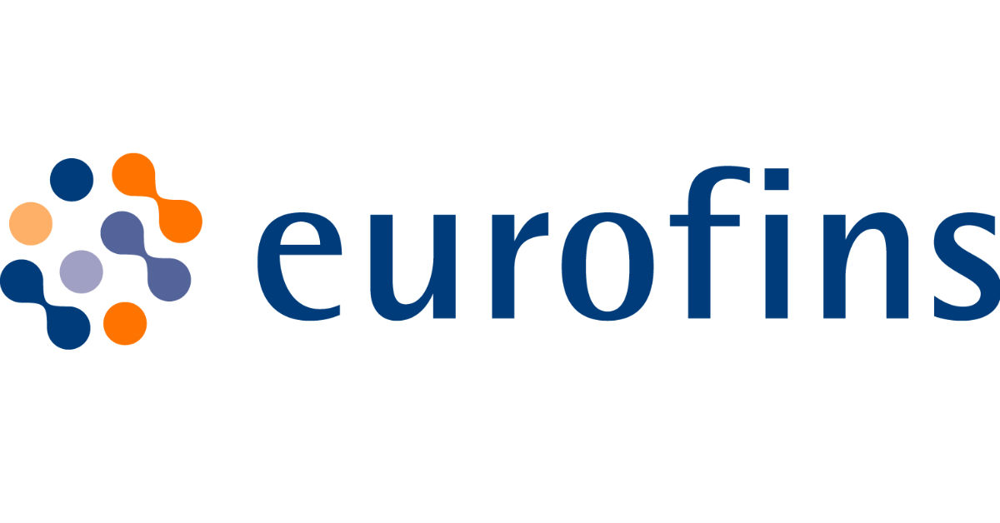
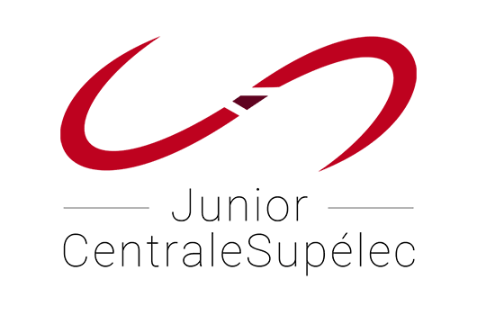
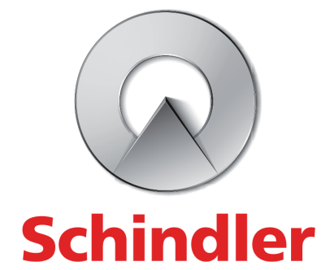
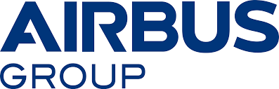

---
# Leave the homepage title empty to use the site title
title: ""
date: 2024-10-04
type: landing

design:
  # Default section spacing
  spacing: "6rem"

sections:
  - block: resume-biography-3
    content:
      # Choose a user profile to display (a folder name within `content/authors/`)
      username: admin_fr
      text: ""
      # Show a call-to-action button under your biography? (optional)
      # button:
      #   text: Download CV
      #   url: https://drive.google.com/file/d/1MMlh1rtOdCdeIpU9QKK-XQv2tei8wmIu/view?usp=share_link
      #   css_class: small-button  # Use a custom class for smaller buttons
    design:
      css_class: dark
      columns: 2
      biography:
        style: 'padding: 10px 0;'  # Adjust the padding values to your preference
      background:
        color: black
        image:
          # Add your image background to `assets/media/`.
          filename: stacked-peaks.svg
          filters:
            brightness: 1.0
          size: cover
          position: center
          parallax: false

  - block: markdown
    content:
      title: "Je vous accompagne pour définir une utilisation raisonnée de l'IA pour votre entreprise :"
      subtitle: ''
      text: |-
        

          <h3>Mon approche</h3>
          En partant de votre besoin métier, je vous accompagne dans votre projet d'explorer des solutions innovantes d'IA, de Data ou de Robotique. J'apporte une attention particulière à vous aider à formuler le problème de façon scientifique et générique en combinant une approche d'ingénieur métier et système.

           

          Vous pouvez retrouver mes différents projets dans l'onglet <a href="https://cetiennec.github.io/etiennechassaing.github.io/fr/projects/">**Portfolio**</a>.

          <h3>Ma spécificité</h3>
          ➡️ J'offre à mes clients une approche de conseil et de formations sur-mesure, en prenant le temps de collaborer en personne avec vous et vos équipes. Grâce à ma formation diversifiée et à mes expériences pluridisciplinaires, je suis en mesure de dialoguer avec les ingénieurs métiers et les responsables de votre entreprise. Une fois le problème clairement défini et correctement formulé, mes compétences en recherche me permettent de vous guider vers des solutions <b>innovantes</b>, aux frontières de l'état de l'art.

          ➡️ Tout au long de ce processus, je m'engage à vous fournir les clés pour comprendre les dernières avancées technologiques, que vous soyez décideur ou ingénieur. En définissant ensemble les métriques clés pour votre projet, je m'assure de livrer une solution à la fois <b>fonctionnelle</b> et parfaitement <b>compréhensible</b> par vos équipes.
           
          <h3>Certifications:</h3>
          - Consultant agréé Crédit Impôt Innovation (CII)

        

          

            <ul style="list-style: none; padding: 0; margin: 0; font-size: 22px;"> <!-- Adjust font-size as needed -->
              <li><a href="https://calendly.com/etienne-chassaing-conseil/30min">👉 Discutons de votre projet: réservez un créneau de 30 min</a></li>
              <li><a href="https://drive.google.com/uc?export=download&id=10lQgXFLiJlWgz_djM01LyL9eDMaK0xiB">📞 Ajoutez moi en contact</a></li>
              <li><a href="mailto:etienne.chassaing.conseil@gmail.com">✉️ Contactez moi par mail</a></li>
              <li><a href="https://www.linkedin.com/in/etienne-chassaing1/">🤝 Contactez moi sur Linkedin</a></li>
            </ul>
          

        

        
        <h3>Ils m'ont fait confiance :</h3>
        

          
          
          
          
          
          
          
          
        

        

      design:
        columns: 1
        style: "margin-bottom: 1px;"  # Adjust the margin here
          # Voici un exemple type :

          # - Un client identifie le besoin de détecter des pannes sur son parc machine
          # - Le client peut avoir une idée de technologie pour mener ce projet
          # - Nous formulons ensemble le problème comme un problème de détection d'anomalies, courant en Machine-Learning
          # - Une fois le problème formulé, nous travaillons ensemble pour éclaircir ce domaine et la ou les technologies envisagés
          # - J'établis une feuille de route pour identifier les technologies les moins risquées, par exemple une famille d'algorithme 
          # - Je vous propose un plan pour réaliser une preuve de concept de la solution et former vos équipes sur cette technologie

    

  # - block: cta-card
  #   demo: false # Only display this section in the Hugo Blox Builder demo site
  #   content:
  #     title: 👉 Discutons de votre projet
  #     text: |- 
  #       Cliquez sur le lien ci-dessous pour réserver un créneau de 30 min et discuter de votre projet.

  #     button:
  #       text: Prendre rendez-vous
  #       url: https://calendly.com/etienne-chassaing-conseil/30min
  #   design:
  #     card:
  #       # Card background color (CSS class)
  #       css_class: "bg-primary-700"
  #       css_style: ""
  #     spacing:
  #       padding: ["0", "30px", "30px", "30px"]  # Adjust padding as needed
  #       margin: ["50px", "0", "40px", "0"]  # Reduces top and bottom margins to 5px, 0 on sides
  #       size: 0.1
  
  # - block: cta-button-list
  #   content:
  #     # Need a custom icon?
  #     # Add an SVG image to the `assets/media/icons/` folder and reference it in the `icon` field below
  #     buttons:
  #       - text: 👉 Discutons de votre projet (créneaux de 30 min)
  #         icon: custom/contact
  #         url: https://calendly.com/etienne-chassaing-conseil/30min
  #       - text: Ajoutez moi en contact
  #         icon: custom/contact
  #         url: https://drive.google.com/uc?export=download&id=1JciEvEQxkVXFb69l4v_F1Mw5LEy27DTY
  #       - text: Contactez moi par mail
  #         icon: at-symbol
  #         url: mailto:etienne.chassaing.conseil@gmail.com
  #       - text: Contactez moi sur Linkedin
  #         icon: brands/linkedin
  #         url: https://www.linkedin.com/in/etienne-chassaing1/

  - block: collection
    id: papers
    content:
      title: Projets récents
      sort_by: 'Date'
      # Choose how many pages you would like to display (0 = all pages)
      count: 9 
      filters:
        folders:
          - project
          - publication
          - formations
        featured_only: false
    design:
      view: article-grid
      columns: 3
      style: "margin-top: 1px;"  # Adjust the margin here

  # - block: collection
  #   id: talks
  #   content:
  #     title: Recent & Upcoming Talks
  #     filters:
  #       folders:
  #         - event
  #   design:
  #     view: article-grid
  #     columns: 1
  - block: collection
    id: news
    content:
      title: Articles de blog récents
      subtitle: ''
      text: ''
      # Page type to display. E.g. post, talk, publication...
      page_type: post
      # Choose how many pages you would like to display (0 = all pages)
      count: 3
      # Filter on criteria
      filters:
        author: ""
        category: ""
        tag: ""
        exclude_featured: false
        exclude_future: false
        exclude_past: false
        publication_type: ""
      # Choose how many pages you would like to offset by
      offset: 0
      # Page order: descending (desc) or ascending (asc) date.
      order: desc
    design:
      # Choose a layout view
      view: date-title-summary
      # Reduce spacing
      spacing:
        padding: [0, 0, 0, 0]
  # - block: collection
  #   content:
  #     title: Publications
  #     text: ""
  #     filters:
  #       folders:
  #         - publication
  #       exclude_featured: false
  #   design:
  #     view: citation

---
