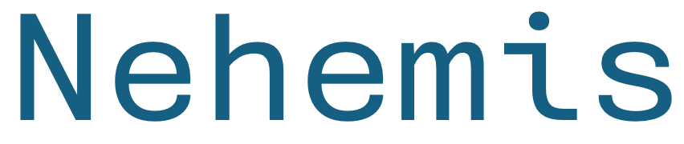
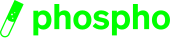
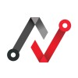
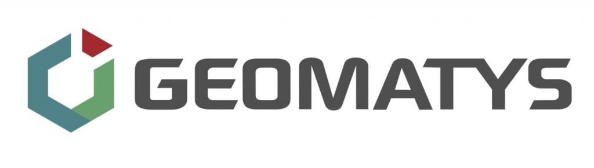
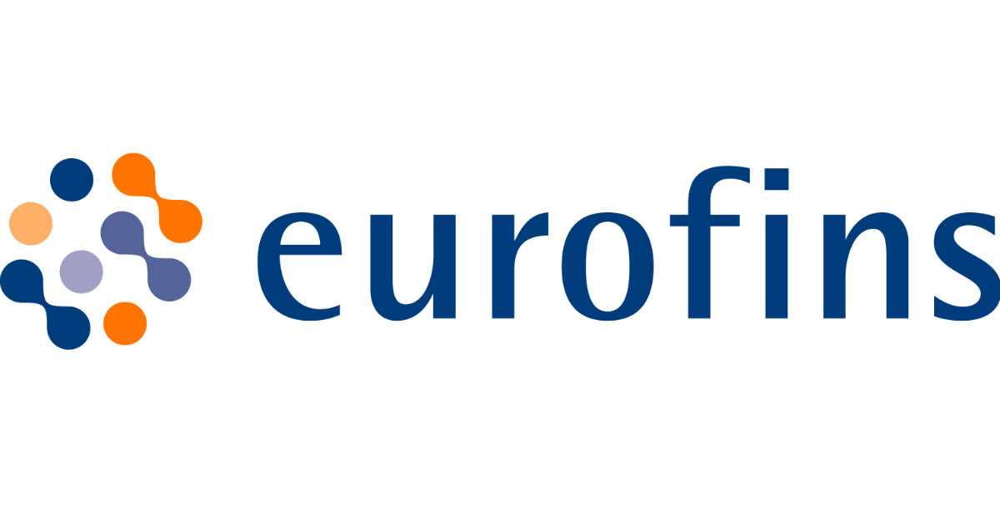
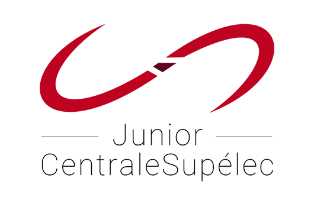
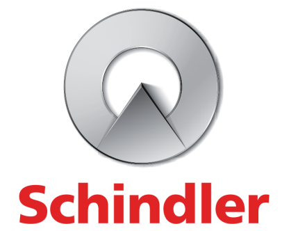
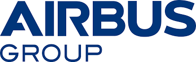

---
# Leave the homepage title empty to use the site title
title: ""
date: 2024-10-04
type: landing

design:
  # Default section spacing
  spacing: "6rem"

sections:
  - block: resume-biography-3
    content:
      # Choose a user profile to display (a folder name within `content/authors/`)
      username: admin_fr
      text: ""
      # Show a call-to-action button under your biography? (optional)
      # button:
      #   text: Download CV
      #   url: https://drive.google.com/file/d/1MMlh1rtOdCdeIpU9QKK-XQv2tei8wmIu/view?usp=share_link
      #   css_class: small-button  # Use a custom class for smaller buttons
    design:
      css_class: dark
      columns: 2
      biography:
        style: 'padding: 10px 0;'  # Adjust the padding values to your preference
      background:
        color: black
        image:
          # Add your image background to `assets/media/`.
          filename: mountain-cover.jpg
          filters:
            brightness: 0.45
          size: cover
          position: center
          parallax: false

  - block: markdown
    content:
      title: ''
      subtitle: ''
      text: |-
        

          Ce site regroupe mon CV, mes cours et supports d'enseignement, mes projets et mes publications.

        

          

            <ul style="list-style: none; padding: 0; margin: 0; font-size: 22px;"> <!-- Adjust font-size as needed -->
              <li><a href="/fr/book/classes/">📚 Voir mes cours</a></li>
              <li><a href="/fr/projects/">🛠️ Voir mes projets</a></li>
              <li><a href="/fr/publication/">📄 Voir mes publications</a></li>
            </ul>
          

        

        <h3>Ils m'ont fait confiance :</h3>
        

          
          
          
          
          
          
          
          
        

        

      design:
        columns: 1
        style: "margin-bottom: 1px;"  # Adjust the margin here

    

  # - block: cta-card
  #   demo: false # Only display this section in the Hugo Blox Builder demo site
  #   content:
  #     title: 👉 Discutons de votre projet
  #     text: |- 
  #       Cliquez sur le lien ci-dessous pour réserver un créneau de 30 min et discuter de votre projet.

  #     button:
  #       text: Prendre rendez-vous
  #       url: https://calendly.com/etienne-chassaing-conseil/30min
  #   design:
  #     card:
  #       # Card background color (CSS class)
  #       css_class: "bg-primary-700"
  #       css_style: ""
  #     spacing:
  #       padding: ["0", "30px", "30px", "30px"]  # Adjust padding as needed
  #       margin: ["50px", "0", "40px", "0"]  # Reduces top and bottom margins to 5px, 0 on sides
  #       size: 0.1
  
  # - block: cta-button-list
  #   content:
  #     # Need a custom icon?
  #     # Add an SVG image to the `assets/media/icons/` folder and reference it in the `icon` field below
  #     buttons:
  #       - text: 👉 Discutons de votre projet (créneaux de 30 min)
  #         icon: custom/contact
  #         url: https://calendly.com/etienne-chassaing-conseil/30min
  #       - text: Ajoutez moi en contact
  #         icon: custom/contact
  #         url: https://drive.google.com/uc?export=download&id=1JciEvEQxkVXFb69l4v_F1Mw5LEy27DTY
  #       - text: Contactez moi par mail
  #         icon: at-symbol
  #         url: mailto:etienne.chassaing.conseil@gmail.com
  #       - text: Contactez moi sur Linkedin
  #         icon: brands/linkedin
  #         url: https://www.linkedin.com/in/etienne-chassaing1/

  - block: collection
    id: papers
    content:
      title: Projets récents
      sort_by: 'Date'
      # Choose how many pages you would like to display (0 = all pages)
      count: 9 
      filters:
        folders:
          - project
          - publication
          - formations
        featured_only: false
    design:
      view: article-grid
      columns: 3
      style: "margin-top: 1px;"  # Adjust the margin here

  # - block: collection
  #   id: talks
  #   content:
  #     title: Recent & Upcoming Talks
  #     filters:
  #       folders:
  #         - event
  #   design:
  #     view: article-grid
  #     columns: 1
  # - block: collection
  #   content:
  #     title: Publications
  #     text: ""
  #     filters:
  #       folders:
  #         - publication
  #       exclude_featured: false
  #   design:
  #     view: citation

---
