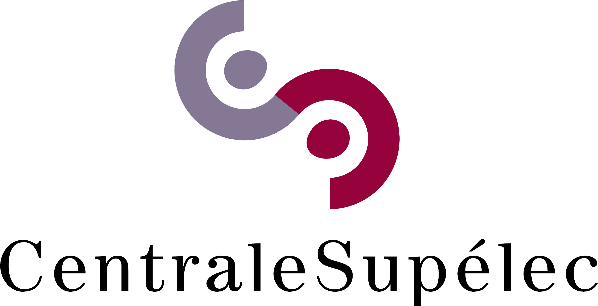
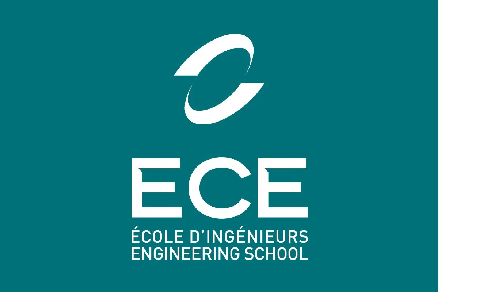

Les supports que j'utilise en enseignement, classés par école. Les sources LaTeX vivent
dans un dépôt privé ; les PDF réellement distribués aux étudiants sont publiés sur
[github.com/cetiennec/cours-pdf](https://github.com/cetiennec/cours-pdf) et servis
directement depuis GitHub.



<a class="school-card" href="centralesupelec/">
  

  
CentraleSupélec

  
Apprentissage par renforcement

</a>

<a class="school-card" href="ece/">
  

  
ECE Paris

  
Systèmes Bouclés

</a>

<a class="school-card" href="albertschool/">
  

  
AlbertSchool

  
Mathematics Foundations

</a>

## [CentraleSupélec — Apprentissage par renforcement](centralesupelec/)

Refonte du cours PARL : quatre séances de cours et des TD écrits, des MDP au contrôle
sans modèle.

## [ECE Paris — Systèmes Bouclés](ece/)

Régulation numérique en promotion complète (500 élèves), d'avril à juin 2026 :
transformée en $z$, discrétisation, PID échantillonné, filtrage et filtre de Kalman.
Six diaporamas, l'examen final et le QCM de mi-parcours.

## [AlbertSchool — Mathematics Foundations](albertschool/)

L'algèbre linéaire et l'analyse derrière le machine learning : vecteurs et similarité
cosinus, matrices et passe avant, dérivées et règle de la chaîne, descente de gradient.
Quatre séances, dispensées en anglais.
