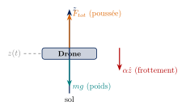
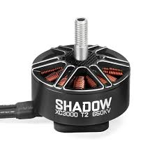
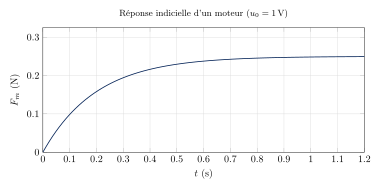
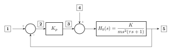
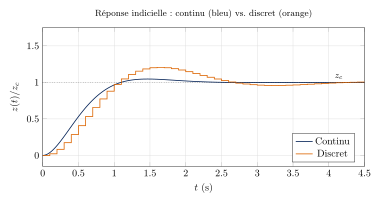
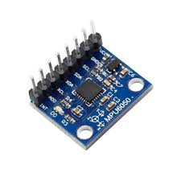

## Contexte

Ce sujet est l'examen final du cours de **Systèmes Bouclés** dispensé à l'ECE Paris
en promotion complète (500 élèves) d'avril à juin 2026. Il est construit comme une
**étude de cas filée** : les quatre parties traitent successivement la modélisation,
l'asservissement continu, la discrétisation et l'implémentation embarquée, puis le
filtrage et la fusion de capteurs — sur un seul et même système, le contrôle en
altitude d'un drone d'observation agricole.

Durée : **1h30** — Calculatrice : **interdite** — Documents : **interdits**.
Le barème total est de 20 points, plus 2 points de bonus.

Le corrigé n'est pas diffusé publiquement. La transcription ci-dessous reprend
l'intégralité du sujet distribué aux étudiants.

<div style="position:relative;padding-top:129%;margin:1.5rem 0;border:1px solid #d4d4d8;border-radius:6px;overflow:hidden;">
  <iframe
    src="https://cdn.jsdelivr.net/gh/cetiennec/cours-pdf@main/ece/systemes-boucles/evaluations/2025-2026/examen-final/diffusion/examen_final.pdf"
    style="position:absolute;top:0;left:0;width:100%;height:100%;border:0;"
    title="Examen final — Systèmes bouclés (PDF)"></iframe>
</div>

**Documents liés :**
[sujet](https://cdn.jsdelivr.net/gh/cetiennec/cours-pdf@main/ece/systemes-boucles/evaluations/2025-2026/examen-final/diffusion/examen_final.pdf) ·
[feuille réponse](https://cdn.jsdelivr.net/gh/cetiennec/cours-pdf@main/ece/systemes-boucles/evaluations/2025-2026/examen-final/diffusion/examen_final_feuille_reponse.pdf) ·
[tous les documents du cours](../)

---

## Consignes

- Répondre **uniquement sur la feuille réponse**, indiquer les étapes principales du
  raisonnement et les résultats finaux. **Utilisez votre brouillon autant que nécessaire !**
- Une annexe est disponible à la fin du sujet.
- En cas de manque de place, une **feuille de secours** est disponible en dernière page
  de la feuille réponse : indiquer le numéro de la question, **encadrer** les résultats
  (tout résultat non encadré ne sera pas pris en compte), et **dessiner un $\triangle$
  dans la boîte réponse concernée** pour signaler au correcteur qu'un complément figure
  en fin de feuille. **En l'absence de ce signe, la feuille complémentaire ne sera pas lue.**
- Le barème indiqué entre parenthèses dans chaque question est **indicatif**.

---

## QCM

*Pour chaque question, une seule réponse est correcte. Noircir la case correspondante
sur la feuille réponse.*

### QCM 1 — Effets des gains PID *(0,5 pt)*

Compléter **?₁** et **?₂** ($T_m$ : temps de montée, $T_s$ : temps de stabilisation,
$D$ : dépassement, $\varepsilon_s$ : erreur statique) :

|                    | $T_m$      | $T_s$      | $D$        | $\varepsilon_s$ |
| ------------------ | ---------- | ---------- | ---------- | --------------- |
| $K_p \nearrow$     | $\searrow$ | $\nearrow$ | $\nearrow$ | $\searrow$      |
| $K_i \nearrow$     | $\searrow$ | $\nearrow$ | $\nearrow$ | **?₁**          |
| $K_d \nearrow$     | $?$        | **?₂**     | $\searrow$ | $?$             |

- **A.** $?_1 = 0$, $?_2 = \searrow$
- **B.** $?_1 = \searrow$, $?_2 = \searrow$
- **C.** $?_1 = 0$, $?_2 = \nearrow$
- **D.** $?_1 = \nearrow$, $?_2 = {?}$

### QCM 2 — Plan de Laplace et plan $z$ *(0,5 pt)*

L'axe imaginaire du plan de Laplace ($\mathrm{Re}(s) = 0$) correspond dans le plan $z$ à :

- **A.** L'axe réel du plan $z$.
- **B.** L'intérieur du cercle unité.
- **C.** Le demi-plan droit du plan $z$.
- **D.** Le cercle unité ($|z| = 1$).

### QCM 3 — Au-delà du PID *(0,5 pt)*

Parmi les affirmations suivantes, laquelle est **vraie** ?

- **A.** Le PID est aujourd'hui peu utilisé en industrie ; il a été largement remplacé
  par des correcteurs modernes.
- **B.** Le Reinforcement Learning permet désormais de remplacer le PID dans la majorité
  des applications industrielles.
- **C.** Un bon réglage de PID nécessite toujours un modèle précis du système.
- **D.** Le PID est l'algorithme de contrôle le plus répandu en industrie grâce à sa
  simplicité et sa versatilité.

### QCM 4 — Système du 1ᵉʳ ordre *(0,5 pt)*

Pour $H(s) = \dfrac{K}{\tau s + 1}$, qu'arrive-t-il quand $\tau$ **augmente** ($K$ fixé) ?

- **A.** La valeur finale ne change pas et la réponse est plus lente.
- **B.** La valeur finale augmente et la réponse est plus lente.
- **C.** La réponse est plus rapide et la valeur finale ne change pas.
- **D.** Le système devient instable.

### QCM 5 — Stabilité : continu vs discret *(0,5 pt)*

Laquelle est **vraie** ?

- **A.** Pôle continu $s = -1 + 2j$ : système instable.
- **B.** Pôle discret $z = -0{,}5$ : stable car $\mathrm{Re}(z) < 0$.
- **C.** $z = 0{,}9$ est plus près de l'instabilité que $z = -0{,}9$.
- **D.** $|z| < 1$ est l'analogue de $\mathrm{Re}(s) < 0$.

---

## Exercice 1 — Transformée de Laplace inverse *(1,5 pt)*

En donnant les étapes, calculer la transformée de Laplace inverse de :

$$F(s) = \frac{1}{(s+1)(2s+5)}$$

---

## Exercice 2 — Discrétisation par BOZ *(1,5 pt)*

On considère le système de premier ordre $H(s) = \dfrac{1}{s+a}$ ($a > 0$) précédé d'un
bloqueur d'ordre zéro de période $T_e$. On rappelle que

$$H_{ZOH}(z) = (1 - z^{-1})\,\mathcal{Z}\left\lbrace \frac{H(s)}{s} \right\rbrace$$

a) Calculer la fonction de transfert du système échantillonné $H_{ZOH}$ (résultat littéral
**en une seule fraction**). *(1 pt)*

b) Application numérique : $a = 2$, $T_e = 0{,}5$ s. Donner $G(z)$. *(0,5 pt)*

---

# Sujet de modélisation

## Partie 1 — Modélisation

> **Définitions — fonctions de transfert**
>
> Convention : $H_{X/Y}(s) = \dfrac{X(s)}{Y(s)}$ est la FT de l'entrée $Y$ vers la sortie $X$.
>
> - $H_{Z/Z_c}(s) = \dfrac{Z(s)}{Z_c(s)}$ (consigne → altitude)
> - $H_{D/Z}(s) = \dfrac{Z(s)}{D(s)}$ (perturbation → altitude)
> - $H_{E/S}(s) = \dfrac{Z(s)}{U(s)}$ (commande → altitude, BO)

Un drone d'observation est utilisé en agriculture pour suivre l'évolution d'un champ.
Pour réaliser une observation répétable, il doit maintenir une altitude $z$ constante
malgré des perturbations extérieures. On modélise le drone comme un point matériel de
masse $m$ se déplaçant verticalement. Le drone est composé de **4 moteurs brushless**
identiques. Chaque moteur reçoit la même tension de commande $u(t)$ (en Volts) et produit
une poussée verticale $F_m(t)$ (en Newtons). Par ailleurs, le drone subit une force de
frottement fluide qu'on notera $\alpha\dot{z}(t)$ ainsi que son poids $-mg$.




*Drone d'observation agricole — source Spray Grass Australia*

| Symbole    | Description                      | Valeur   | Unité     |
| ---------- | -------------------------------- | -------- | --------- |
| $m$        | Masse du drone                   | $1{,}5$  | kg        |
| $g$        | Accélération gravitationnelle    | $9{,}81$ | m/s²      |
| $\alpha$   | Coefficient de frottement fluide | $0{,}15$ | N·s/m     |

### Question 1 — Équation dynamique *(0,5 pt)*

En appliquant le PFD selon l'axe $z$ orienté vers le haut, écrire l'équation
différentielle du mouvement. On notera $F_{tot}(t)$ la poussée totale et on exprimera
$F_{tot}(t)$ en fonction de $F_m(t)$.

### Question 2 — Transformée de Laplace *(0,5 pt)*

*On considère la force de gravité comme une perturbation constante notée $D$ (en Newtons).*

Donner l'expression de la constante $D$ (en N), puis écrire la transformée de Laplace de
l'équation obtenue en Q1 (conditions initiales nulles). On notera $F(s)$ la transformée de
Laplace de la poussée totale et $D(s)$ la transformée de Laplace de la perturbation.

### Question 3 — Identification du moteur

*On cherche à relier la poussée $F_m(t)$ d'un moteur à la tension de commande $u(t)$.
On applique un échelon $u_0 = 1$ V et on observe la réponse indicielle ci-dessous.*


*Moteur brushless*



**3.A — Ordre du système *(0,5 pt)*** — Déterminer l'ordre du système et justifier à partir
de la courbe.

**3.B — Identification graphique *(0,5 pt)*** — Identifier graphiquement le gain statique
$K_m$ et la constante de temps $\tau$.

**3.C — Fonction de transfert du moteur *(0,5 pt)*** — En déduire la fonction de transfert
du moteur $H_m(s) = \dfrac{F_m(s)}{U(s)}$ en utilisant la transformée de Laplace.

### Question 4 — Forme factorisée *(0,5 pt)*

En remplaçant $F(s)$ avec le résultat de Q3.C dans l'expression de Q2, exprimer $Z(s)$
sous la forme

$$Z(s) = H_{E/S}(s)\,U(s) + H_{D/Z}(s)\,D(s)$$

en donnant $H_{E/S}(s)$ et $H_{D/Z}(s)$ sous forme **factorisée**.

### Question 5 — Schéma bloc *(0,5 pt)*

Compléter le schéma bloc en feuille réponse en inscrivant la fonction de transfert de
chaque bloc (forme factorisée).

### Question 6 — Pôles et zéros de $H_{E/S}(s)$ *(0,75 pt)*

Placer les pôles (**×**) et les zéros (**o**) de $H_{E/S}(s)$ sur le plan de Laplace de la
feuille réponse ($\alpha \neq 0$). Le système est-il stable ?

---

## Partie 2 — Asservissement en position

On suppose désormais $\alpha = 0$ (pas de frottement). Le système {moteurs + drone} se
réduit à :

$$H_0(s) = \frac{K}{m\,s^2(\tau s + 1)}$$

On admet le schéma bloc de boucle fermée suivant :



### Question 2.1 — Identifier les grandeurs du schéma bloc *(0,5 pt)*

Nommer les cinq grandeurs **1** à **5** indiquées sur le schéma ci-dessus.

### Question 2.2a — Transferts en boucle fermée *(1 pt)*

Rappeler et nommer la formule générale de la fonction de transfert en boucle fermée
$H_{Z/Z_c}(s)$ en fonction de $K_p$ et $H_0(s)$. Développez ensuite cette expression et
donnez le résultat.

*On admet que la fonction de transfert $H_{D/Z}$ a pour expression développée :*

$$H_{D/Z}(s) = \frac{\tau s + 1}{m s^2 (\tau s + 1) + K_p K}$$

### Question 2.2b — Théorème de la valeur finale *(1,25 pt)*

On applique simultanément un échelon de consigne $Z_c = Z_0$ et la perturbation
gravitationnelle $D_0$ traitée comme un **échelon** $D(s) = D_0/s$.

1. Donner la valeur numérique de $D_0$ (en N) et en déduire $D(s)$. *(0,5 pt)*
2. Par le principe de superposition et le **théorème de la valeur finale**, calculer
   séparément $z_\infty^{ref}$ (contribution de la consigne) et $z_\infty^{pert}$
   (contribution de la perturbation). *(0,5 pt)*
3. En déduire $z_\infty$ et l'erreur statique résiduelle
   $\varepsilon_\infty = Z_0 - z_\infty$. *(0,25 pt)*

### Question 2.2c — Analyse qualitative *(0,75 pt)*

Analyser qualitativement le résultat de la question 2.2b. Quel est le signe de l'erreur
statique ? Que se passe-t-il lorsque $K_p$ augmente ? Quelle est la limite de ce
correcteur P ?

### Question 2.3 — Rôle de l'action intégrale (correcteur PI) *(0,5 pt)*

On remplace le correcteur P par un correcteur PI :
$C(s) = K_p\left(1 + \dfrac{1}{T_i s}\right)$.
Expliquer qualitativement pourquoi l'action intégrale supprime l'erreur statique due à la
perturbation gravitationnelle.

### Question bonus — Autre approche sans intégrateur ? *(+1 bonus)*

Voyez-vous une autre approche permettant d'annuler l'erreur due à la gravité, sans ajouter
d'intégrateur au correcteur ?

### Question 2.4 — Action dérivée et vent *(0,75 pt)*

On envisage d'ajouter une action dérivée au correcteur :
$C(s) = K_p\left(1 + \dfrac{1}{T_i s} + T_d s\right)$.

a. Quel est l'intérêt de l'action dérivée dans la régulation d'altitude ? Expliquer
   qualitativement son effet sur la dynamique de la boucle.
b. Le drone vole par vent variable (rafales, turbulences). Quel risque l'action dérivée
   introduit-elle dans ce cas ?

---

## Partie 3 — Discrétisation et implémentation

On implémente la commande sur un microcontrôleur ESP32 fonctionnant à la période
d'échantillonnage $T_e$. On place un bloqueur d'ordre zéro (BOZ) en sortie du calculateur.
On considère le procédé simplifié ($\alpha = 0$) :

$$H_0(s) = \frac{K}{m\,s^2(\tau s + 1)}$$


*Microcontrôleur ESP32*

### Question 3.1 — Système échantillonné avec BOZ *(0,75 pt)*

On place un bloqueur d'ordre zéro $B_0(s)$ en amont du procédé continu $H_0(s)$.

a) Expliquer ce que fait le bloqueur d'ordre zéro.
b) Donner la relation qui permet d'écrire la fonction de transfert du système échantillonné
   en fonction de $B_0(s)$ et $H_0(s)$.
c) Expliquer quel est l'intérêt de calculer le système échantillonné pour l'étude du
   système bouclé.

### Question bonus — Système échantillonné avec BOZ *(+1 bonus)*

Redémontrer la forme développée donnée en annexe (avec un dessin). **À faire en dernier si
le temps le permet.**

### Question 3.2.a — Méthode de discrétisation d'Euler arrière *(0,5 pt)*

Rappeler la formule de substitution de la méthode d'Euler arrière. Expliquer en une phrase
pourquoi on parle d'Euler « arrière ».

### Question 3.2.b — Équations de récurrence P, I, D *(0,75 pt)*

En appliquant la substitution de Q3.2.a au correcteur PID continu
$C(s) = K_p\left(1 + \dfrac{1}{T_i s} + T_d s\right)$, écrire les équations de récurrence
des trois composantes $u_P[k]$, $u_I[k]$, $u_D[k]$.

### Question 3.2.c — Filtre sur la voie dérivée *(0,75 pt)*

L'action dérivée telle que définie en Q3.2.b est problématique en pratique. Identifier le
problème en expliquant **avec un dessin ou une équation** et indiquer quel élément il faut
ajouter sur la voie dérivée. Donner la fonction de transfert correspondante.

### Question 3.3 — Implémentation Python *(0,5 pt)*

Compléter les trois lignes manquantes (marquées `___`) du code Python ci-dessous, qui
implémente le PID discret (Euler arrière) de la question 3.2.

```python
Kp = 2.0;  Ti = 1.5;  Td = 0.1;  Te = 0.05   # (s)
integral = 0.0;  prev_error = 0.0

def pid_step(setpoint, measure):
    global integral, prev_error
    error = setpoint - measure
    u_P = ________________________________     # (1)
    integral = integral + ______________       # (2)
    u_I = integral
    u_D = ________________________________     # (3)
    prev_error = error
    return u_P + u_I + u_D
```

### Question 3.4 — Analyse des réponses *(1 pt)*

On compare la réponse à un échelon de consigne avec le même correcteur PID en version
continue (trait plein bleu) et en version discrète $T_e = 0{,}1$ s (tirets orange).
Identifier la différence principale et indiquer quel gain du correcteur il faut modifier,
et dans quel sens, pour rapprocher la réponse discrète de la réponse continue.
**Détaillez votre raisonnement en expliquant les phénomènes physiques en jeu.**



---

## Partie 4 — Filtrage

Le drone est équipé d'un accéléromètre pour mesurer son accélération verticale. Ce capteur
est échantillonné à $f_e = 100$ Hz.


*Accéléromètre MPU6050*

### Question 4.1 — Filtrage de l'accéléromètre *(0,5 pt)*

Quel type de filtre faut-il placer en amont de la numérisation pour limiter le repliement
spectral ? Quelle est sa fréquence de coupure ?

### Question 4.2 — Estimation d'altitude par fusion de capteurs *(0,75 pt)*

Le drone est aussi équipé d'un GPS numérisé à $10$ Hz et d'un accéléromètre. Quel type de
filtre permet de **fusionner** ces deux sources ? À quelle fréquence est-il calculé ?
En comparant les **écarts types** typiques des deux capteurs, expliquer son principe en
quelques phrases en soulignant les mots clés.

---

## Annexe

### Transformées de Laplace usuelles

| $f(t),\; t \geq 0$        | $F(s) = \mathcal{L}\lbrace f \rbrace$      |
| ------------------------- | ------------------------------------------ |
| $\delta(t)$               | $1$                                        |
| $\mathbf{1}(t)$           | $\dfrac{1}{s}$                             |
| $t$                       | $\dfrac{1}{s^2}$                           |
| $e^{-at}$                 | $\dfrac{1}{s+a}$                           |
| $t\,e^{-at}$              | $\dfrac{1}{(s+a)^2}$                       |
| $\sin(\omega t)$          | $\dfrac{\omega}{s^2 + \omega^2}$           |
| $\cos(\omega t)$          | $\dfrac{s}{s^2 + \omega^2}$                |
| $e^{-at}\sin(\omega t)$   | $\dfrac{\omega}{(s+a)^2 + \omega^2}$       |
| $e^{-at}\cos(\omega t)$   | $\dfrac{s+a}{(s+a)^2 + \omega^2}$          |

### Bloqueur d'ordre zéro (BOZ)

$$B_0(s) = \frac{1 - e^{-T_e s}}{s} \qquad\qquad G(z) = (1 - z^{-1})\,\mathcal{Z}\left\lbrace \frac{G(s)}{s} \right\rbrace$$

### Transformées en $z$ usuelles

| $f[k]$          | $F(z)$                        |
| --------------- | ----------------------------- |
| $\delta[k]$     | $1$                           |
| $\mathbf{1}[k]$ | $\dfrac{z}{z-1}$              |
| $k T_e$         | $\dfrac{T_e\,z}{(z-1)^2}$     |
| $e^{-aT_e k}$   | $\dfrac{z}{z - e^{-aT_e}}$    |

### Valeurs numériques de $e^{-x}$

| $x$      | $e^{-x}$ | $1 - e^{-x}$ |
| -------- | -------- | ------------ |
| $0{,}05$ | $0{,}951$ | $0{,}049$   |
| $0{,}1$  | $0{,}905$ | $0{,}095$   |
| $0{,}2$  | $0{,}819$ | $0{,}181$   |
| $0{,}3$  | $0{,}741$ | $0{,}259$   |
| $0{,}5$  | $0{,}607$ | $0{,}393$   |
| $1$      | $0{,}368$ | $0{,}632$   |
| $1{,}5$  | $0{,}223$ | $0{,}777$   |
| $2$      | $0{,}135$ | $0{,}865$   |
| $3$      | $0{,}050$ | $0{,}950$   |
