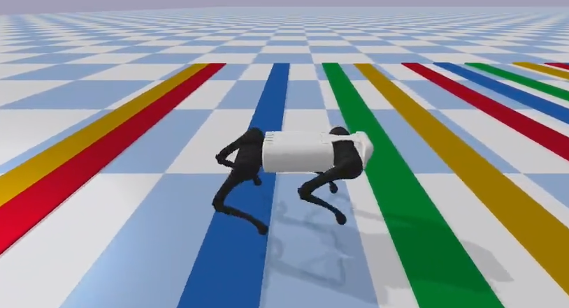

# Foundations of artificial intelligence

*Principe du MPC*

## Résumé

The course presents the design, control, and applications of legged robots. It gives a review of different types of legged robots (including two-, four- and multi-legged robots), and an analysis of different control methods for legged locomotion.

## Contenu
The course presents the design, control, and applications of legged robots. It gives a review of different types of legged robots (including two-, four- and multi-legged robots), and analysis of different control methods for legged locomotion. It also trains students in making critical analysis of key articles in the field, and in designing their own models and locomotion controllers for legged robots in simulation.

-History of legged robotics, including two-, four-, and multi-legged robots
-Review of mechanical structures of legged robots, passive and dynamic walkers
-Background concepts: dynamic versus static stability, different stability criteria (e.g. Zero-Moment Point ZMP, capturability, ...), energy consumption, cost of transport (COT), state estimation.
-Simple models of locomotion: rimless wheel, inverted pendulums, linear inverted pendulum (LIP), spring-loaded inverted pendulum (SLIP), template versus anchor models
-Analysis of different control approaches: trajectory-based methods, virtual leg control, virtual model control, hybrid-zero dynamics, optimal control, planning approaches, approaches based on reinforcement learning, and bioinspired approaches.
-Critical literature review and presentation: Students will read several important articles in the field, and present them to the class.
-Numerical exercises: The course will also involve numerical exercises in which students will develop their own controllers for simulated legged robots (with weekly sessions with assistants and the professor).

Source : 
[EPFL](https://edu.epfl.ch/coursebook/en/legged-robots-MICRO-507)
