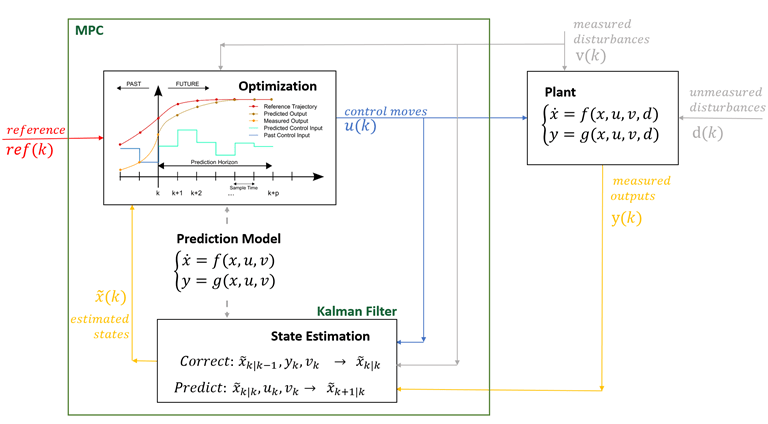

# Foundations of artificial intelligence

*Principe du MPC*

## Résumé

This course provides the students with 1) a set of theoretical concepts to understand the machine learning approach; and 2) a subset of the tools to use this approach for problems arising in mechanical engineering applications.

Provide an introduction to the theory and practice of Model Predictive Control (MPC). Main benefits of MPC: flexible specification of time-domain objectives, performance optimization of highly complex multivariable systems and ability to explicitly enforce constraints on system behavior.

## Contenu

-Review of convex optimization and required optimal control theory.
-Receding-horizon control for constrained linear systems.
-Practical issues: Tracking and offset-free control of constrained systems.
-Theoretical properties of constrained control: Constraint satisfaction and invariant set theory, Stability of MPC.
-Introduction to advanced topics in predictive control.
-Simulation-based project providing practical experience with MPC.

Source : 
[EPFL](https://edu.epfl.ch/coursebook/en/model-predictive-control-ME-425)
[MathWorks](https://fr.mathworks.com/help/mpc/gs/what-is-mpc.html)