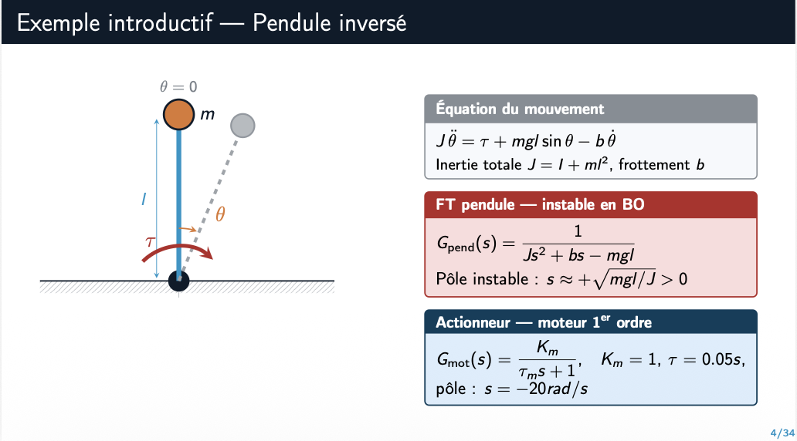

*Systèmes Bouclés - ECE Paris*

## Résumé

D'avril à juin 2026, cours de Systèmes Bouclés à l'ECE Paris, dispensé en promotion complète devant 500 élèves.

Le cours porte sur la régulation numérique : transformée en $z$, discrétisation, PID
échantillonné, filtrage et filtre de Kalman.

## Supports de cours

Tous les documents distribués aux étudiants sont publiés sur ce site — six diaporamas de
cours, l'examen final, les QCM individualisés et le rattrapage :

**[→ Supports de cours et évaluations](/fr/book/classes/)**

L'examen final est construit comme une étude de cas filée sur le contrôle en altitude d'un
drone d'observation, et est [transcrit intégralement ici](/fr/book/classes/examen-final-ece/).
