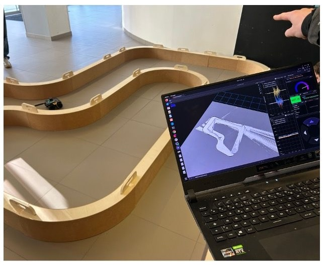

*Voiture autonome et SLAM - ECE Paris*

## Résumé

D'avril à juin 2026, encadrement d'un projet robotique pour les élèves de 4ème année de l'ECE Paris, portant sur la conception d'une voiture autonome et l'implémentation du SLAM (Simultaneous Localization and Mapping).
