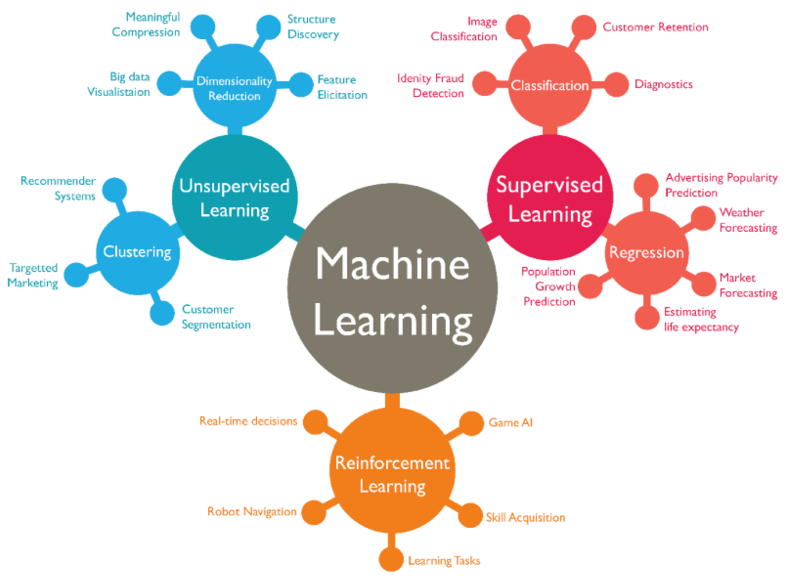

# Foundations of artificial intelligence

*Taxonomie de l'IA, source Google*

## Résumé

This course provides the students with 1) a set of theoretical concepts to understand the machine learning approach; and 2) a subset of the tools to use this approach for problems arising in mechanical engineering applications.

## Contenu

Tools
Supervised learning: regression and classification
Unsupervised learning: singular value decomposition, K-means
Deep learning: brief introduction to neural networks
Reinforcement learning: brief introduction to policy gradient method
 
Theory
Optimization: role of convexity, gradient descent, least-squares
Statistics: Bayesian approach, bias and variance trade-off

Source : 
[EPFL](https://edu.epfl.ch/coursebook/en/foundations-of-artificial-intelligence-ME-390)