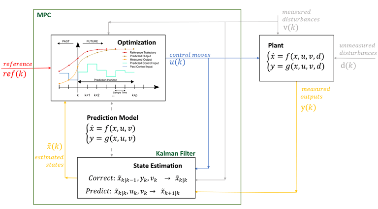

*Principe du Model Predictive Control*

Formation réalisée en **février 2025 chez [Nehemis](https://nehemis.com)** à destination des
**équipes software**. L'objectif : donner à des développeurs qui ne sont pas automaticiens
de quoi comprendre, régler et débugger une boucle de contrôle, puis situer le Model
Predictive Control par rapport à un PID — quand il apporte quelque chose, et à quel prix.

Le programme ci-dessous est celui qui a été déroulé ; il est adaptable à votre système et
au temps disponible.

---

## Partie 1 — Comprendre un système dynamique

- Système en boucle ouverte et en boucle fermée : ce que la rétroaction change.
- Modélisation d'un procédé simple, notion de fonction de transfert, pôles et stabilité.
- Lecture d'une réponse indicielle : gain statique, constante de temps, dépassement,
  temps de réponse.
- Identification expérimentale d'un procédé à partir de mesures réelles.

## Partie 2 — Le correcteur PID en pratique

- Rôle de chaque action : proportionnelle, intégrale, dérivée, et ce que chacune coûte.
- Erreur statique, rejet de perturbation, marge de stabilité.
- Méthodes de réglage : approche empirique, Ziegler-Nichols, réglage guidé par le modèle.
- Les pièges d'implémentation qui font échouer un PID correct sur le papier :
  emballement de l'intégrateur (*anti-windup*), saturation d'actionneur, bruit amplifié
  par l'action dérivée et filtrage de cette voie.
- Discrétisation : période d'échantillonnage, forme récurrente du correcteur, effets du
  temps de calcul et des retards.

## Partie 3 — Introduction au Model Predictive Control

- Principe : optimiser une séquence de commandes sur un horizon glissant plutôt que
  réagir à l'erreur instantanée.
- Formulation du problème d'optimisation : modèle de prédiction, fonction de coût,
  horizons de prédiction et de commande.
- Ce que le MPC sait faire et que le PID ne sait pas : **contraintes explicites** sur les
  entrées et les états, systèmes **multivariables** (MIMO), anticipation d'une consigne
  connue à l'avance.
- Le prix à payer : besoin d'un modèle, coût de calcul, sensibilité aux erreurs de
  modélisation.
- Critères de choix : dans quels cas un PID bien réglé reste la bonne réponse.

## Partie 4 — Applications

- Mise en situation sur un système représentatif du métier des participants.
- Comparaison PID / MPC sur le même procédé : performance, respect des contraintes,
  robustesse.
- Discussion des cas d'usage internes et des suites possibles.

---

Cette formation est proposée en français ou en anglais, sur site ou à distance, et se
décline en une à trois journées selon la profondeur souhaitée sur la partie MPC.
