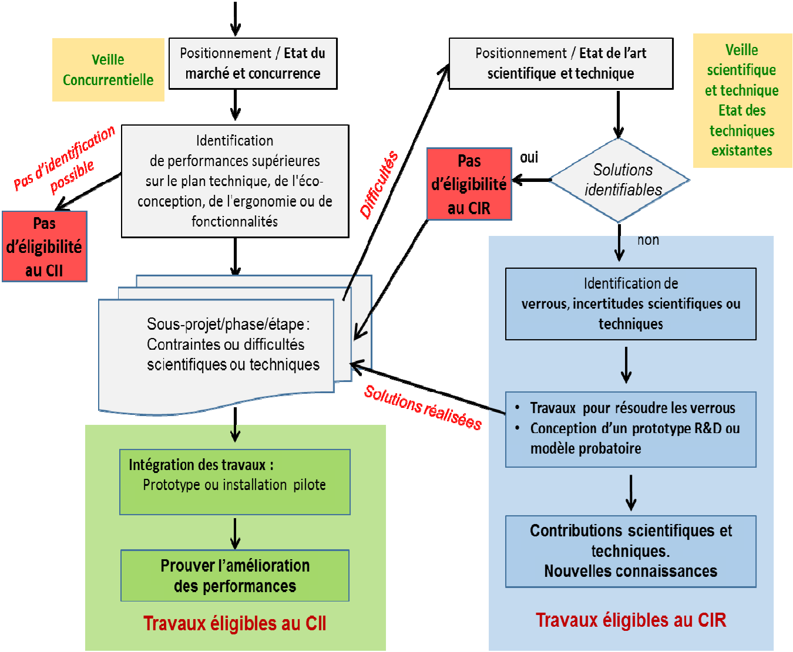

# Comprendre le Crédit d'Impôt Innovation (CII) et ses Avantages pour les Entreprises

Le **Crédit d'Impôt Innovation (CII)** est un dispositif mis en place par le ministère de l'Économie en France pour encourager l'innovation au sein des entreprises. Ce crédit d'impôt s'adresse spécifiquement aux PME et a pour objectif de soutenir les projets innovants qui engendrent des dépenses significatives en recherche et développement. 

### Qu'est-ce que le CII ?

Le CII permet aux entreprises de bénéficier d'un crédit d'impôt calculé sur les dépenses engagées pour des opérations d'innovation. Il couvre un large éventail d'activités, notamment la conception de nouveaux produits, l'amélioration de procédés, et le développement de solutions technologiques. Pour bénéficier du CII, les entreprises doivent démontrer que leurs projets présentent un caractère innovant, ce qui peut inclure des aspects techniques, technologiques ou de service.

### Les Avantages du CII pour les Entreprises

1. **Réduction Fiscale** : Le CII permet aux entreprises de récupérer une partie des coûts associés à leurs projets d'innovation, réduisant ainsi leur charge fiscale. Cela peut avoir un impact significatif sur la trésorerie, notamment pour les jeunes entreprises ou les PME.

2. **Soutien à l'Innovation** : En incitant les entreprises à innover, le CII favorise le développement de nouveaux produits et services. Cela peut aider les entreprises à se différencier sur le marché et à répondre aux besoins évolutifs de leurs clients.

3. **Attractivité pour les Investisseurs** : Les entreprises bénéficiant d'un agrément CII sont souvent perçues comme plus attractives par les investisseurs, car elles montrent un engagement envers l'innovation et le développement. Cela peut faciliter le financement de projets futurs.

### Pourquoi Travailler avec un Consultant Agréé CII ?

En tant que consultant agréé CII, je suis en mesure d'accompagner les entreprises dans le processus d'obtention de ce crédit d'impôt. Mon expertise me permet d'identifier les dépenses éligibles, de rédiger les dossiers nécessaires et de maximiser les chances d'obtenir l'agrément. Grâce à ma compréhension des enjeux et des exigences du CII, je peux aider les entreprises à tirer le meilleur parti de cette opportunité, tout en leur permettant de se concentrer sur leur cœur de métier.

### Conclusion

Le Crédit d'Impôt Innovation est un levier puissant pour les entreprises souhaitant innover et se développer. Avec mon agrément CII jusqu'en 2028, je suis prêt à accompagner les entreprises dans leur parcours d'innovation. Ensemble, nous pourrons transformer des idées novatrices en réalités tangibles tout en optimisant les coûts grâce à ce dispositif avantageux.

Le CII est complémentaire avec le dispositif CIR selon le diagramme suivant:

*Classification CII vs CIR*

Plus d'informations sur :
https://entreprendre.service-public.fr/vosdroits/F35494